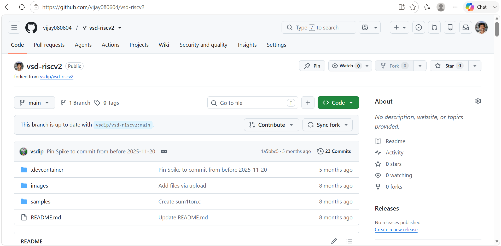
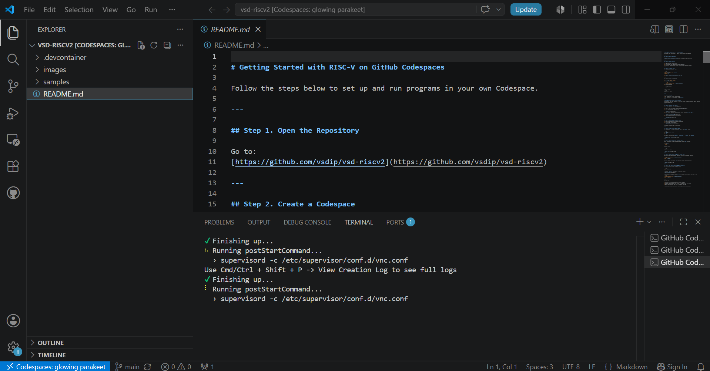
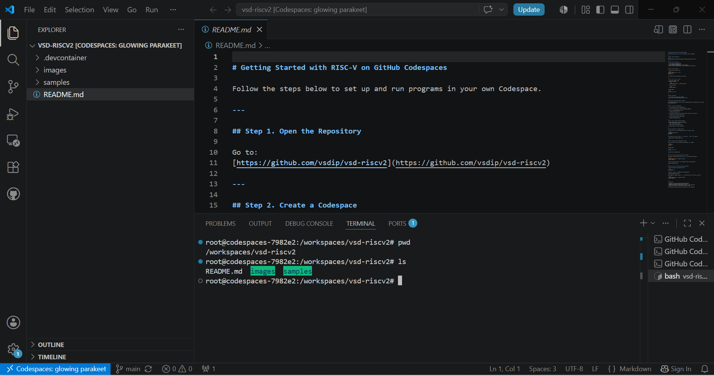
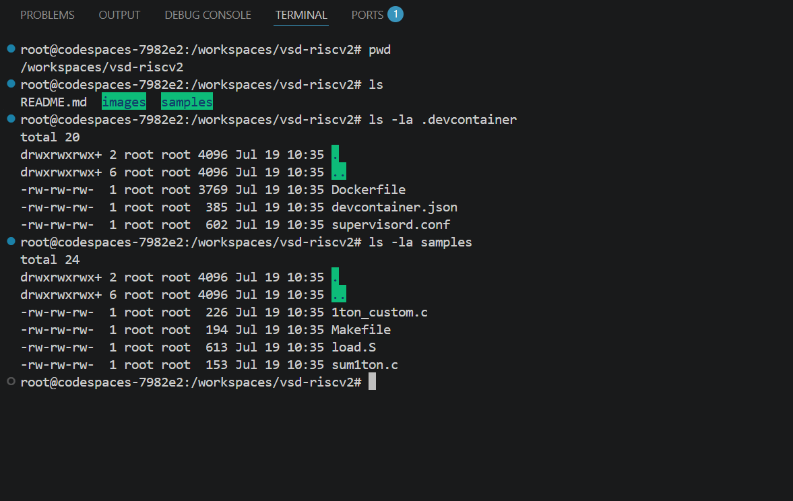

# Task-1: Environment Setup & RISC-V Reference Bring-Up

## Objective

Set up the official development environment, validate the RISC-V reference design, and prepare the workflow for upcoming IP development and FPGA tasks.

---

## Learning Objectives

- Set up the GitHub Codespaces development environment.
- Explore the repository structure.
- Understand the development environment configuration.
- Identify the sample RISC-V applications and build files.
- Understand the build workflow before executing the reference program.

---

## Activities

- Fork the official `vsd-riscv2` repository
- Launch GitHub Codespace
- Explore the repository structure
- Analyze the sample build system
- Build and execute the reference RISC-V program *(In Progress)*
- Clone and run the `vsdfpga_labs`
- Understand the RISC-V execution flow
- Prepare the local development environment

---

## Repository

### Official Repository

https://github.com/vsdip/vsd-riscv2

### Personal Fork

https://github.com/vijay080604/vsd-riscv2

---

## Environment

| Item | Details |
|------|---------|
| Development Environment | GitHub Codespaces |
| Interface | VS Code Desktop |
| Operating System | Ubuntu (Codespace Container) |
| Working Directory | `/workspaces/vsd-riscv2` |

---

## Repository Structure

```text
vsd-riscv2
│
├── .devcontainer
├── images
├── samples
└── README.md
```

### Directory Overview

| Directory / File | Description |
|------------------|-------------|
| `.devcontainer` | Configuration files used to create the GitHub Codespaces development environment. |
| `images` | Stores images used throughout the project documentation. |
| `samples` | Contains sample RISC-V programs, startup assembly, and the Makefile used for compilation. |
| `README.md` | Provides instructions for setting up and using the reference repository. |

---

## Repository Exploration

### Development Environment Files

The `.devcontainer` directory contains the files responsible for creating and configuring the development environment.

| File | Purpose |
|------|---------|
| `Dockerfile` | Defines the software environment used by GitHub Codespaces. |
| `devcontainer.json` | Configures the Codespace environment and startup behavior. |
| `supervisord.conf` | Starts background services required by the Codespace environment. |

---

### Sample Programs

The `samples` directory contains the reference programs used throughout the internship.

| File | Purpose |
|------|---------|
| `Makefile` | Automates the build process for the sample program. |
| `load.S` | Startup assembly executed before the C application begins. |
| `sum1ton.c` | Sample C program demonstrating a simple computation. |
| `1ton_custom.c` | Sample C program for demonstrating custom functionality. |

---

## Build System Overview

The sample project uses a Makefile to automate compilation.

### Build Flow

```text
Makefile
     │
     ▼
Generate hello.c
     │
     ▼
RISC-V GCC Compiler
     │
     ▼
Generate hello.elf
```

At this stage, the Makefile has been analyzed to understand the compilation flow. The build process will be executed in the next section.

---

# Proof of Completion

## Step 1: Repository Fork

<p align="center">
  
</p>

**Figure 1.** Successfully forked the official `vsd-riscv2` repository into my personal GitHub account.

---

## Step 2: GitHub Codespace

<p align="center">
  
</p>

<p align="center">
  
</p>

**Figure 2.** GitHub Codespace was successfully initialized and connected using VS Code Desktop. The repository was mounted successfully and verified using the `pwd` and `ls` commands.

---

## Step 3: Repository Exploration

<p align="center">
  
</p>

**Figure 3.** Explored the repository structure and inspected the `.devcontainer` and `samples` directories to understand the development environment and sample project organization.

---

## Commands Executed

| No. | Command | Purpose | Observation |
|----:|---------|----------|-------------|
| 1 | `pwd` | Display the current working directory. | Verified the repository was mounted under `/workspaces/vsd-riscv2`. |
| 2 | `ls` | List the repository contents. | Verified the top-level directories and files. |
| 3 | `ls -la .devcontainer` | Inspect the development environment configuration files. | Identified the Dockerfile, Codespace configuration, and supervisor configuration. |
| 4 | `ls -la samples` | Explore the sample program directory. | Identified the Makefile, startup assembly, and sample C programs. |
| 5 | `cat samples/Makefile` | Display the Makefile contents. | Understood the automated build process before execution. |

---

## Key Learnings

| Topic | Learning |
|--------|----------|
| GitHub Codespaces | Provides a preconfigured cloud-based development environment. |
| Repository Structure | The repository is organized into environment configuration, documentation, and sample programs. |
| `.devcontainer` | Defines how the development environment is automatically created. |
| `samples` | Contains the reference RISC-V applications and supporting build files. |
| Makefile | Automates the process of generating and compiling a RISC-V executable. |
| Build Flow | The Makefile generates a C source file, compiles it using the RISC-V GCC toolchain, and produces an ELF executable. |

---

## Progress Summary

| Status | Description |
|--------|-------------|
| ✅ Repository Fork | Completed |
| ✅ GitHub Codespace Setup | Completed |
| ✅ Repository Exploration | Completed |
| ✅ Makefile Analysis | Completed |
| ⏳ Reference Program Execution | In Progress |
| ⏳ VSDFPGA Labs | Pending |
| ⏳ Local Environment Setup | Pending |
| ⏳ Understanding Questions | Pending |