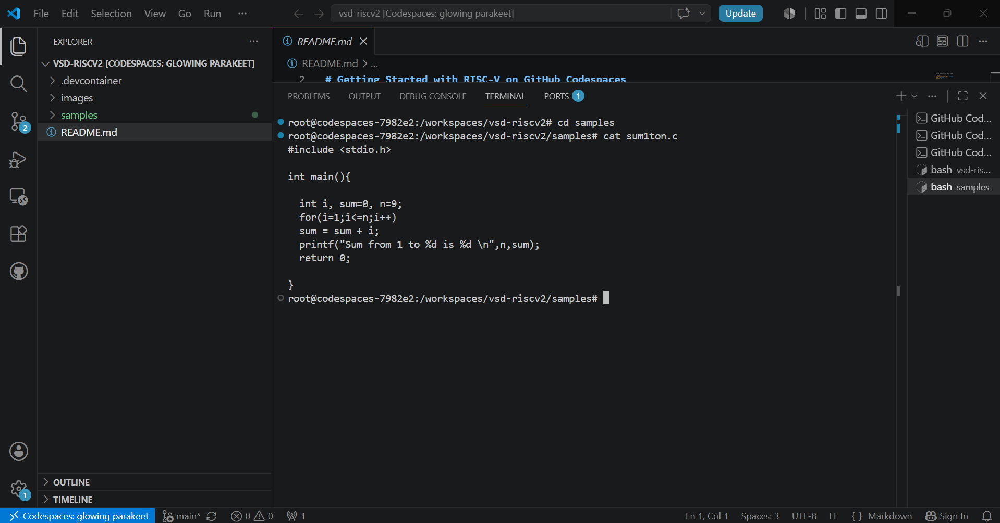
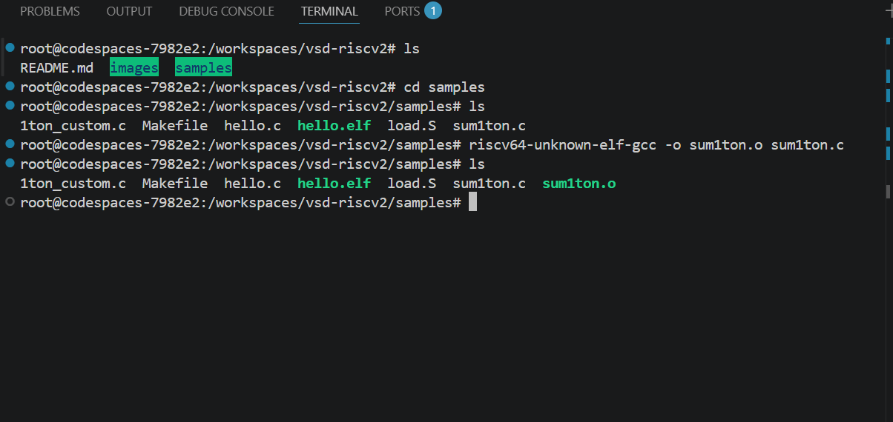
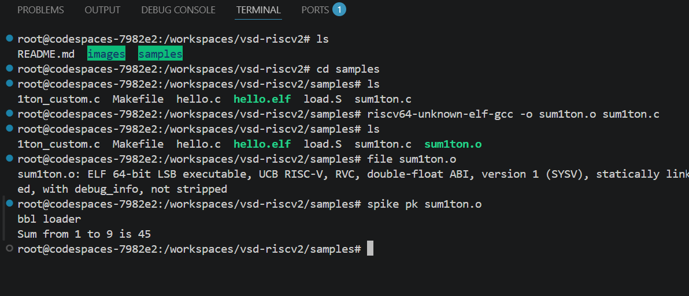
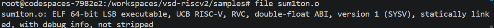
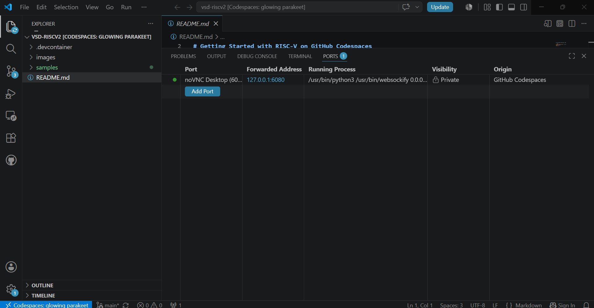
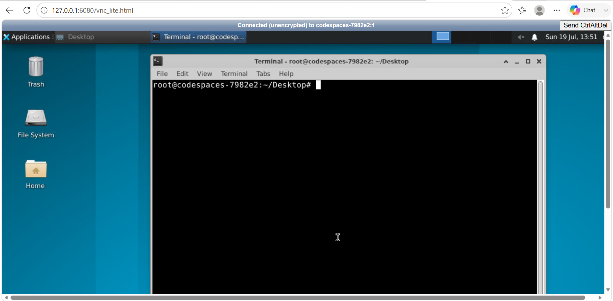
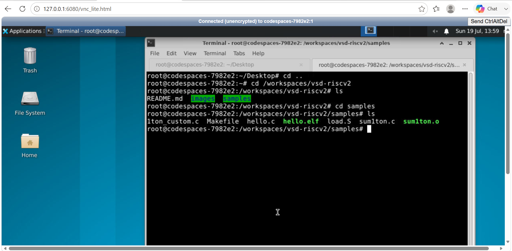
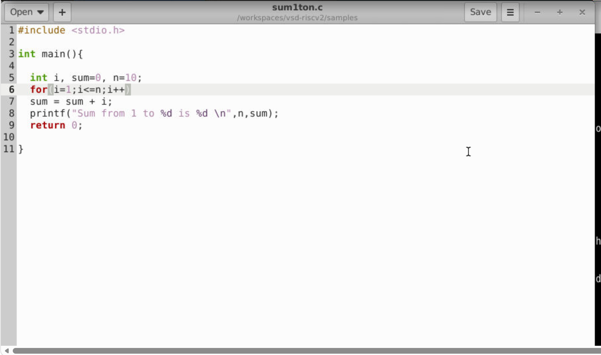
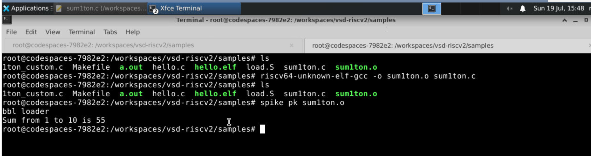

# Task-1: Environment Setup & RISC-V Reference Bring-Up

> **Internship:** RISC-V FPGA IP Design Internship  
> **Organization:** VLSI System Design (VSD)  
> **Task:** Environment Setup & RISC-V Reference Bring-Up

---

#  Overview

Every digital hardware project begins with a reliable development environment. Before designing custom hardware IPs or implementing FPGA-based systems, it is essential to establish a software workflow capable of compiling, executing, and validating RISC-V applications.

This task focuses on setting up the official development environment provided for the internship and understanding how a RISC-V program progresses from source code to execution. Rather than simply running a reference application, the objective is to explore the complete software toolchain, examine the repository structure, understand the build process, and validate the execution flow using the **Spike ISA Simulator**.

Throughout this task, every component involved in the software development pipeline—including the cross compiler, executable format, simulator, and runtime environment—is studied to build a strong foundation for the upcoming FPGA and custom IP development tasks.

---

#  Objectives

The primary objectives of this task are:

- Configure the official development environment using GitHub Codespaces.
- Explore the structure of the reference repository.
- Understand the purpose of the development container.
- Study the Makefile-based build system.
- Compile a RISC-V application using the cross compiler.
- Execute the generated executable using the Spike ISA Simulator.
- Understand the role of the Proxy Kernel during program execution.
- Compare native execution with cross-compiled RISC-V execution.
- Explore GUI-based development using the noVNC desktop.

---

#  Development Environment

The complete development environment is hosted in **GitHub Codespaces**, providing a pre-configured Ubuntu-based workspace with all the required RISC-V development tools already installed.

| Component | Details |
|-----------|---------|
| Development Platform | GitHub Codespaces |
| Operating System | Ubuntu Linux |
| IDE | Visual Studio Code |
| Target Architecture | RISC-V |
| Host Architecture | x86-64 |
| Simulator | Spike ISA Simulator |
| Runtime | Proxy Kernel (pk) |

Using a cloud-based development environment ensures that every participant works with an identical software configuration, eliminating dependency and installation issues while allowing immediate focus on learning the RISC-V workflow.

---

# Repository

## Official Repository

```
https://github.com/vsdip/vsd-riscv2
```

## Personal Fork

```
https://github.com/vijay080604/vsd-riscv2
```

The repository was first forked into my personal GitHub account to maintain an independent copy for experimentation, documentation, and future development throughout the internship.

---

#  Exploring the Repository

Understanding the organization of a project is the first step toward effective development. Before compiling or executing any application, the repository structure was explored to identify the purpose of each directory and understand how the development environment is organized.

---

## Repository Layout

```text
vsd-riscv2
│
├── .devcontainer
├── images
├── samples
└── README.md
```

---

### `.devcontainer`

The `.devcontainer` directory contains the configuration required to automatically create the GitHub Codespaces development environment.

Instead of manually installing compilers, simulators, and supporting tools, Codespaces reads these configuration files and builds a reproducible Linux workspace.

The directory contains:

| File | Description |
|------|-------------|
| Dockerfile | Defines the Ubuntu-based software environment. |
| devcontainer.json | Configures the Codespace startup environment. |
| supervisord.conf | Launches background services required inside the container. |

---

### `samples`

The **samples** directory contains the reference applications used throughout the internship.

These applications demonstrate the complete software development workflow, beginning with C source code and ending with execution on a simulated RISC-V processor.

| File | Description |
|------|-------------|
| Makefile | Automates the build process. |
| load.S | Startup assembly executed before the application. |
| hello.c | Simple reference application. |
| sum1ton.c | Example program used throughout this task. |
| 1ton_custom.c | Sample application for experimentation. |

---

### `images`

This directory stores all screenshots and figures used to document the implementation process.

Maintaining screenshots alongside the documentation provides clear evidence of successful execution while making the repository easier to understand.

---

#  Repository Exploration

## Repository Fork

<p align="center">

</p>

**Figure 1.** Official repository successfully forked into the personal GitHub account.

---

## GitHub Codespaces Initialization

<p align="center">

</p>

<p align="center">

</p>

**Figure 2.** GitHub Codespace successfully initialized and connected using Visual Studio Code.

---

## Repository Structure Verification

<p align="center">

</p>

**Figure 3.** Repository directories explored to understand the overall project organization.

---

# ⚙ Understanding the Build System

One of the most important components of any software project is its build system. Instead of manually compiling every source file, build automation tools simplify the development workflow by defining all compilation steps in a single location.

The reference repository uses a **GNU Makefile** to automate this process.

Rather than directly invoking the compiler every time, the Makefile specifies:

- Which source files should be generated.
- Which compiler should be used.
- Which compiler options should be applied.
- What executable should be produced.

This approach ensures that every build follows a consistent and reproducible process.

---

## Build Workflow

```text
                Makefile
                    │
                    ▼
         Generate hello.c
                    │
                    ▼
   RISC-V Cross Compiler
(riscv64-unknown-elf-gcc)
                    │
                    ▼
            hello.elf
```

The generated executable (`hello.elf`) targets the **RISC-V architecture**, making it suitable for execution on the Spike ISA Simulator rather than on the host machine.

Before running any application, understanding this build pipeline is essential because every subsequent task in the internship relies on the same software development workflow.

---

## Why Study the Build Process?

Although the Makefile hides much of the compilation complexity, understanding what happens internally is important for embedded software development.

A RISC-V application follows a series of well-defined stages:

```text
C Source Code
      │
      ▼
Cross Compiler
      │
      ▼
RISC-V Executable
      │
      ▼
Spike ISA Simulator
      │
      ▼
Proxy Kernel
      │
      ▼
Program Execution
```

This execution flow forms the software foundation for all future tasks involving custom IP development, SoC integration, and FPGA implementation.
# Compiling the First RISC-V Application

After understanding how the build system is organized, the next step is to validate the software toolchain by compiling the reference application provided in the repository.

The objective of this exercise is not only to generate an executable, but also to understand how a C program is transformed into a RISC-V executable that can be executed on a simulated processor.

The reference repository provides a Makefile that automates the complete build process.

---

## Navigating to the Sample Directory

The sample applications are located inside the `samples` directory.

```bash
cd samples
```

This directory contains the source files, startup assembly, linker configuration, and the Makefile required for building the reference applications.

---

## Building the Reference Application

The reference application was compiled using the following command.

```bash
make hello-spike
```

<p align="center">

</p>

<p align="center">

</p>

The Makefile automatically performs the following operations:

- Generates the source file `hello.c`
- Invokes the RISC-V cross compiler
- Produces the executable `hello.elf`

The successful completion of the build confirms that the development environment has been configured correctly.

---

## Build Flow

```text
            hello.c
                │
                ▼
   RISC-V Cross Compiler
(riscv64-unknown-elf-gcc)
                │
                ▼
            hello.elf
```

Unlike a native executable, the generated file contains RISC-V machine instructions and therefore cannot be executed directly on the host machine.

---

## Verifying the Build Output

The generated files were verified using:

```bash
ls -l
```

The output confirms that both the source file and the executable have been successfully created.

```text
hello.c
hello.elf
```

The presence of `hello.elf` indicates that the compilation completed successfully without any errors.

---

## Inspecting the Executable

The executable format was verified using the Linux `file` utility.

```bash
file hello.elf
```

<p align="center">

</p>

Output:

```text
ELF 64-bit LSB executable,
UCB RISC-V,
RVC,
double-float ABI,
statically linked,
not stripped
```

The output confirms that the executable targets the **RISC-V Instruction Set Architecture (ISA)** rather than the x86-64 processor used by the development environment.

---

# Understanding the Generated Executable

The executable generated during compilation follows the **Executable and Linkable Format (ELF)**, which is the standard executable format used by Linux systems and supported by the RISC-V toolchain.

An ELF executable contains considerably more information than machine instructions alone.

It includes:

- Program entry point
- Machine instructions
- Data sections
- Memory layout information
- Symbol table
- Debugging information

During execution, the simulator reads this information to correctly load the application into memory before transferring control to the program.

---

# Executing the Reference Application

Since `hello.elf` contains RISC-V instructions, it cannot execute directly on an x86-64 processor.

Instead, the executable must be executed using the **Spike ISA Simulator**, which emulates a complete RISC-V processor.

Before executing the application, the availability of the simulator and the runtime environment was verified.

---

## Verifying the Spike ISA Simulator

```bash
spike --help
```

The command displays the available simulator options and confirms that the Spike simulator has been installed correctly.

---

## Verifying the Proxy Kernel

The location of the Proxy Kernel was verified using:

```bash
which pk
```

<p align="center">

</p>

Output

```text
/opt/riscv/riscv64-unknown-elf/bin/pk
```

The output confirms that the runtime environment required for executing RISC-V applications is available.

---

## Executing the Application

The compiled executable was executed using Spike together with the Proxy Kernel.

```bash
spike pk hello.elf
```

Output

```text
bbl loader
```

The application completed successfully without reporting any runtime errors.

The message **"bbl loader"** is generated by the Proxy Kernel during initialization.

Since the sample application does not print any data to the terminal, no additional output is expected.

The successful execution confirms that:

- the cross compiler generated a valid executable,
- the Spike simulator successfully emulated the RISC-V processor,
- the Proxy Kernel initialized the runtime environment correctly.

---

# Software Execution Flow

The complete software execution pipeline followed during this task is illustrated below.

```text
             C Program
            (hello.c)
                 │
                 ▼
      RISC-V Cross Compiler
                 │
                 ▼
            hello.elf
        (ELF Executable)
                 │
                 ▼
      Spike ISA Simulator
                 │
                 ▼
       Proxy Kernel (pk)
                 │
                 ▼
         Program Execution
```

This execution pipeline forms the software foundation for every subsequent task in the internship.

Every custom hardware IP, software application, or FPGA demonstration developed later will ultimately follow the same sequence of compilation and execution.

---

# Engineering Concepts

## Why is a Cross Compiler Required?

The development environment used during this internship runs on an **x86-64 processor**, whereas the target platform follows the **RISC-V Instruction Set Architecture**.

Because both processors understand different machine instructions, a normal GCC compiler cannot generate software for a RISC-V processor.

Instead, a **cross compiler** is required.

A cross compiler executes on one architecture while generating machine code for another.

```text
Host Machine (x86-64)

        │

        ▼

Cross Compiler

        │

        ▼

RISC-V Executable
```

Without cross compilation, software developed on the host system could never execute on the target RISC-V processor.

---

## Why Can't `hello.elf` Run Directly?

Although `hello.elf` is an executable, it contains RISC-V machine instructions rather than x86-64 instructions.

For this reason, the operating system running on the host processor cannot execute it directly.

Instead, the executable is loaded into the Spike simulator, which behaves like a software implementation of a RISC-V processor.

```text
hello.elf

     │

     ▼

Spike Simulator

     │

     ▼

Simulated RISC-V Processor
```

Spike interprets each RISC-V instruction exactly as a physical processor would execute it.

---

## Understanding Spike ISA Simulator

Spike is the official functional simulator for the RISC-V architecture.

Rather than translating instructions, Spike emulates the internal behavior of a RISC-V processor.

Its responsibilities include:

- fetching instructions,
- decoding instructions,
- executing RISC-V operations,
- maintaining processor registers,
- managing memory accesses.

This makes Spike an essential tool for software validation before running applications on real hardware.

---

## Understanding the Proxy Kernel

The Proxy Kernel (`pk`) acts as a lightweight runtime environment between the executable and the simulator.

Its responsibilities include:

- loading the executable into memory,
- initializing the runtime environment,
- setting up the stack,
- preparing program arguments,
- transferring control to the application's `main()` function.

Unlike a complete operating system, the Proxy Kernel provides only the minimal functionality required for bare-metal RISC-V applications.

This lightweight design makes it ideal for architecture validation and software development.
# Executing a Custom RISC-V Application

After validating the software toolchain using the reference `hello-spike` example, the next objective was to compile and execute one of the sample applications provided in the repository.

The program selected for this task is `sum1ton.c`, a simple C application that computes the sum of integers from **1 to 9** and prints the result.

Although the program itself is straightforward, it demonstrates the complete software execution flow of a RISC-V application, beginning with C source code and ending with execution on a simulated processor.

---

## Inspecting the Source Program

Before compiling the application, the source code was examined to understand its functionality and expected output.

```bash
cat sum1ton.c
```

<p align="center">

</p>

The program performs a simple iterative summation and prints the final result using the standard C library.

Reviewing the source before compilation helps establish a clear understanding of the expected behavior during execution.

---

## Cross Compiling the Application

The application was compiled using the RISC-V cross compiler.

```bash
riscv64-unknown-elf-gcc -o sum1ton.o sum1ton.c
```

<p align="center">

</p>

Compilation completed successfully and produced the executable file `sum1ton.o`.

Although the file uses the `.o` extension in this repository, it is a complete executable generated for the RISC-V architecture.

---

## Compilation Flow

```text
          sum1ton.c
               │
               ▼
RISC-V Cross Compiler
(riscv64-unknown-elf-gcc)
               │
               ▼
          sum1ton.o
      (RISC-V Executable)
```

The compiler translates the C source code into RISC-V machine instructions while also generating the executable metadata required by the runtime environment.

---

## Executing the Application

The generated executable was executed using the Spike ISA Simulator together with the Proxy Kernel.

```bash
spike pk sum1ton.o
```

<p align="center">

</p>

<p align="center">

</p>

Program Output

```text
Sum from 1 to 9 is 45
```

The successful execution confirms that:

- the application was compiled correctly,
- the executable contains valid RISC-V instructions,
- the Spike simulator executed every instruction successfully,
- the Proxy Kernel initialized the runtime environment correctly,
- the generated output matches the expected result.

---

## Complete Execution Flow

```text
          sum1ton.c
                │
                ▼
      Cross Compilation
                │
                ▼
        RISC-V Executable
                │
                ▼
      Spike ISA Simulator
                │
                ▼
       Proxy Kernel (pk)
                │
                ▼
       Execute Application
                │
                ▼
  Sum from 1 to 9 is 45
```

The successful completion of this workflow validates the complete RISC-V software toolchain provided within the development environment.

---

# GUI-Based Development Using noVNC

While command-line tools are sufficient for software compilation and execution, many stages of VLSI and FPGA development require graphical applications.

To support these tools, GitHub Codespaces provides a browser-based Linux desktop using **noVNC**.

This graphical environment allows Linux GUI applications to run directly inside the browser without requiring a separate Linux installation.

Later tasks in the internship will make extensive use of applications such as:

- Magic
- GTKWave
- Xschem
- gedit

Understanding how to access and use this environment is therefore an important part of the development workflow.

---

## Launching the Desktop Environment

The graphical desktop was launched by opening the forwarded **Port 6080** from the GitHub Codespaces **PORTS** tab.

Opening `vnc_lite.html` provides access to a complete Ubuntu desktop running inside the development container.

<p align="center">

</p>

<p align="center">

</p>

---

## GUI Development Workflow

```text
GitHub Codespaces

        │

        ▼

Forward Port (6080)

        │

        ▼

noVNC Desktop

        │

        ▼

Ubuntu Linux Desktop

        │

        ▼

GUI Applications
```

The graphical desktop shares the same filesystem as the terminal environment, allowing both interfaces to access the same project files.

---

## Accessing the Workspace

After opening the graphical desktop, a terminal session was started and the project directory was accessed.

```bash
cd /workspaces/vsd-riscv2
cd samples
ls -ltr
```

<p align="center">

</p>

<p align="center">

</p>

<p align="center">

</p>

The project files inside the graphical environment were verified successfully, confirming that both the terminal interface and the desktop environment operate on the same workspace.

---

# Native Compilation

Until this point, every application had been compiled for the RISC-V architecture.

To understand the difference between native execution and cross execution, the same application was compiled using the host compiler.

```bash
gcc sum1ton.c
```

This produced the executable

```text
a.out
```

The executable was then run directly on the host processor.

```bash
./a.out
```

<p align="center">

</p>

Output

```text
Sum from 1 to 9 is 45
```

This execution takes place entirely on the host x86-64 processor without requiring the Spike simulator.

---

# Cross Compilation

The same source program was then compiled once again for the RISC-V architecture.

```bash
riscv64-unknown-elf-gcc -o sum1ton.o sum1ton.c
```

<p align="center">

</p>

The executable was validated using Spike.

```bash
spike pk sum1ton.o
```

<p align="center">

</p>

Output

```text
Sum from 1 to 9 is 45
```

Although both execution methods produce the same numerical result, they execute on completely different processor architectures.

One executes directly on the host CPU, while the other executes on a simulated RISC-V processor.

---

# Editing and Rebuilding the Application

One advantage of the graphical desktop environment is the ability to modify source code using graphical editors.

The source file was opened using **gedit**.

```bash
gedit sum1ton.c &
```

<p align="center">

</p>

After modifying the source code, the application was rebuilt using the RISC-V cross compiler and executed again.

<p align="center">

</p>

The updated program executed successfully, demonstrating the complete edit–compile–execute cycle within the graphical development environment.

This workflow will be used extensively during subsequent internship tasks involving hardware description languages, simulations, waveform analysis, and layout verification.
# Native Execution and Cross Execution

During this task, the same application was executed using two different approaches. Although both methods produced the same output, the compilation process, executable format, and execution environment were fundamentally different.

## Native Execution

Native execution refers to compiling the application for the processor on which the operating system is currently running.

```text
          sum1ton.c
               │
               ▼
          Native GCC
               │
               ▼
             a.out
               │
               ▼
      Host x86-64 Processor
```

The executable generated by the native compiler contains x86-64 machine instructions and therefore executes directly on the host processor without requiring any simulation.

---

## Cross Execution

Cross execution involves compiling the same application for a different processor architecture.

```text
          sum1ton.c
               │
               ▼
    RISC-V Cross Compiler
               │
               ▼
          sum1ton.o
               │
               ▼
      Spike ISA Simulator
               │
               ▼
       Simulated RISC-V CPU
```

Since the generated executable contains RISC-V instructions, it cannot execute directly on the host processor. Instead, Spike emulates the target architecture and executes the application instruction by instruction.

---

## Comparison

| Native Execution | Cross Execution |
|------------------|-----------------|
| Executed directly on the host processor | Executed on a simulated RISC-V processor |
| Uses the native GCC compiler | Uses the RISC-V cross compiler |
| Generates an x86-64 executable | Generates a RISC-V executable |
| Does not require simulation | Requires the Spike ISA Simulator |
| Intended for the host machine | Intended for the target architecture |

Although the execution environments differ, both workflows produce identical application behavior when implemented correctly.

---

# Command-Line and Graphical Development

The internship environment supports both command-line and graphical development.

Each workflow serves a different purpose and both become important during FPGA and VLSI development.

## Command-Line Workflow

The terminal provides a fast and efficient interface for navigating directories, compiling applications, executing programs, and performing automation tasks.

```text
Source Code
      │
      ▼
Compile
      │
      ▼
Execute
      │
      ▼
Verify
```

---

## Graphical Workflow

The noVNC desktop enables the use of Linux GUI applications that cannot be operated entirely through the command line.

```text
GitHub Codespaces
        │
        ▼
noVNC Desktop
        │
        ▼
GUI Applications
        │
        ▼
Development and Verification
```

Graphical tools such as Magic, GTKWave, Xschem, and gedit will become increasingly important during the later stages of the internship, particularly for circuit visualization, waveform analysis, layout development, and debugging.

---

# Commands Executed

The following commands were executed throughout this task to explore the repository, build applications, validate the software toolchain, and understand the execution workflow.

| No. | Command | Purpose |
|----:|---------|---------|
| 1 | `pwd` | Verify the current working directory. |
| 2 | `ls` | Display repository contents. |
| 3 | `ls -la .devcontainer` | Inspect development container configuration. |
| 4 | `ls -la samples` | Explore the sample applications. |
| 5 | `cat samples/Makefile` | Study the automated build process. |
| 6 | `cd samples` | Navigate to the sample directory. |
| 7 | `make hello-spike` | Build the reference application. |
| 8 | `ls -l` | Verify generated build artifacts. |
| 9 | `file hello.elf` | Inspect the executable format. |
| 10 | `spike --help` | Verify the Spike simulator installation. |
| 11 | `which pk` | Locate the Proxy Kernel. |
| 12 | `spike pk hello.elf` | Execute the reference application. |
| 13 | `cat sum1ton.c` | Examine the source code. |
| 14 | `riscv64-unknown-elf-gcc -o sum1ton.o sum1ton.c` | Cross compile the sample application. |
| 15 | `file sum1ton.o` | Verify the generated executable. |
| 16 | `spike pk sum1ton.o` | Execute the RISC-V application. |
| 17 | `gcc sum1ton.c` | Compile the application natively. |
| 18 | `./a.out` | Execute the native application. |
| 19 | `gedit sum1ton.c &` | Edit the source code graphically. |
| 20 | `riscv64-unknown-elf-gcc -o sum1ton.o sum1ton.c` | Rebuild the modified application. |
| 21 | `spike pk sum1ton.o` | Verify the updated application. |

---

# Key Learnings

This task provided an understanding of the complete software workflow used throughout the internship.

The major concepts explored include:

- Setting up a cloud-based RISC-V development environment using GitHub Codespaces.
- Understanding the organization of the reference repository.
- Exploring the purpose of the development container configuration.
- Understanding the role of the Makefile in automating software compilation.
- Compiling applications using the RISC-V cross compiler.
- Understanding the structure and purpose of ELF executables.
- Executing RISC-V software using the Spike ISA Simulator.
- Understanding the responsibility of the Proxy Kernel during program initialization.
- Comparing native execution with cross execution.
- Working with both terminal-based and graphical Linux development environments.
- Performing the complete software development cycle consisting of source code inspection, compilation, execution, verification, modification, rebuilding, and validation.

These concepts establish the software foundation required before progressing toward processor design, hardware IP development, FPGA implementation, and system-level integration.

---

# Task Outcome

The objectives defined for this task were successfully completed.

The development environment was configured using GitHub Codespaces, the repository structure was explored, and the software build process was analyzed.

Reference applications were compiled and executed successfully using the RISC-V cross compiler, Spike ISA Simulator, and Proxy Kernel. The generated executables were verified, and both native and cross-compilation workflows were evaluated to understand their differences.

The graphical development environment provided by noVNC was also explored, demonstrating that both terminal-based and GUI-based workflows operate on the same project workspace.

Completion of this task establishes a working software environment that will be used throughout the remaining internship activities involving hardware design, verification, custom IP development, and FPGA implementation.

---

# Conclusion

This task introduced the complete software workflow required for RISC-V application development. Rather than focusing only on executing commands, the activities were used to understand how source code is transformed into executable machine instructions and how those instructions are executed on a simulated RISC-V processor.

The concepts explored in this task—including cross compilation, executable formats, software simulation, runtime initialization, and development environments—form the foundation for the remaining stages of the internship.

With the software toolchain successfully validated, the environment is now prepared for subsequent tasks involving hardware description languages, processor customization, memory design, FPGA implementation, and complete RISC-V system development.

---

# References

1. Official RISC-V ISA Specification  
   https://riscv.org/technical/specifications/

2. Spike RISC-V ISA Simulator  
   https://github.com/riscv-software-src/riscv-isa-sim

3. RISC-V Proxy Kernel (pk)  
   https://github.com/riscv-software-src/riscv-pk

4. Official Internship Repository  
   https://github.com/vsdip/vsd-riscv2

5. GitHub Codespaces Documentation  
   https://docs.github.com/en/codespaces

6. GNU Make Documentation  
   https://www.gnu.org/software/make/manual/

7. ELF Specification  
   https://refspecs.linuxfoundation.org/elf/